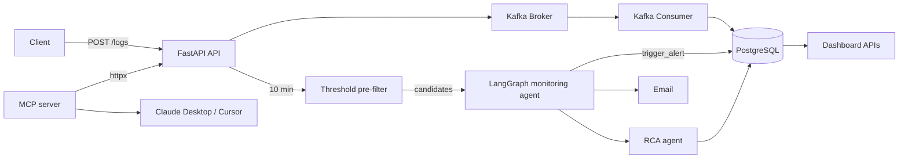

# LogSentinel

**AI-Powered Distributed Log Monitoring & Incident Intelligence Platform**

LogSentinel is a production-style distributed observability system that performs real-time log ingestion, automated anomaly detection, agentic alerting, and multi-step AI root cause analysis.

Built using FastAPI, Kafka, PostgreSQL, and Docker, it uses an **LLM agent (LangGraph + Anthropic Claude)** to reason about incidents instead of relying on static thresholds alone, and exposes its data to AI assistants (Claude Desktop, Cursor) through a built-in **MCP server**.

---

## 📖 Overview

LogSentinel simulates a production-grade observability pipeline:

1. Applications send logs via REST API
2. Logs are streamed through Kafka
3. A consumer processes and stores logs in PostgreSQL
4. A cheap threshold pre-filter selects candidate services each cycle
5. A LangGraph monitoring agent investigates candidates (error rate, log content, alert history) and decides whether to alert, assigning a severity (LOW/MEDIUM/HIGH/CRITICAL)
6. When an alert fires, an agentic RCA pipeline runs: it fetches logs +/-10 min around the alert, finds the first error, detects cascades across services, and produces a structured RCA report
7. Email notifications are sent with the agent reasoning + RCA report
8. A dashboard visualizes logs, alerts (with severity + agent reasoning), and RCA reports
9. An MCP server exposes the platform's data to AI assistants (Claude Desktop, Cursor)

The platform demonstrates event-driven architecture, distributed systems design, agentic reasoning (LangGraph), and the Model Context Protocol for operational intelligence.

---

## 🏗 Architecture



### Components

- **API Service** – Log ingestion, dashboard endpoints, RCA endpoint
- **Kafka Broker** – Message streaming backbone
- **Consumer Service** – Processes and stores logs
- **PostgreSQL** – Persistent storage (`logs`, `alerts`, `service_alerts`, `alert_history`)
- **Monitoring Agent** – Threshold pre-filter + LangGraph agent that decides and classifies alerts
- **RCA Agent** – Multi-step root cause analysis with cascade detection
- **MCP Server** – Exposes observability data to AI assistants
- **Email Notification Service** – Sends alert emails with agent reasoning + RCA
- **Dashboard UI** – Visualizes logs, alerts, and RCA reports
- **Docker Compose / Railway** – Orchestration & deployment

---

## 🚀 Features

- Real-time log ingestion
- Kafka-based streaming pipeline
- Hybrid monitoring: deterministic threshold pre-filter + LangGraph LLM agent
- Severity classification (LOW / MEDIUM / HIGH / CRITICAL) with 30-minute dedup
- Agentic multi-step root cause analysis with cascade detection
- Agent reasoning trace and RCA report stored in Postgres and shown in the dashboard
- MCP server for Claude Desktop / Cursor integration
- Email notifications for critical alerts
- Anthropic Claude for all LLM calls
- Fully containerized environment + Railway deployment config

---

## 📧 Email Alerts

When error rates exceed configured thresholds:

- An alert is created and stored in the database
- The system sends an automated email notification
- Email contains:
  - Service name
  - Error rate percentage
  - Time window analyzed
  - Alert timestamp
  - AI Root Cause Summary:
    - Likely cause:
    - Suggested action

### Example Use Cases

- Service crash detection
- Error spike detection
- Production incident notification
- Automated operational monitoring

### Example Environment Variables for Email

```bash
SMTP_HOST=smtp.gmail.com
SMTP_PORT=587
SMTP_USER=your_email@gmail.com
SMTP_PASSWORD=your_app_password
ALERT_TO=admin@example.com
ALERT_FROM=alerts@example.com
```

> ⚠️ Use app-specific passwords for production environments.

---

## ⚙️ Setup & Installation

### 1️⃣ Clone Repository

```bash
git clone https://github.com/yourusername/LogSentinel.git
cd LogSentinel
```

### 2️⃣ Create Environment File

Copy `.env.example` to `.env` and fill in the values. See the full table below.

```bash
cp .env.example .env
```

| Variable | Required | Purpose |
|----------|----------|---------|
| `DATABASE_URL` | yes | SQLAlchemy Postgres connection string |
| `POSTGRES_DB` / `POSTGRES_USER` / `POSTGRES_PASSWORD` | yes (compose) | Postgres container credentials |
| `KAFKA_BOOTSTRAP_SERVERS` | yes | Kafka broker (default `kafka:9092`) |
| `KAFKA_TOPIC` | no | Topic name (default `logs`) |
| `ANTHROPIC_API_KEY` | for AI | Anthropic API key; without it the agents fall back to deterministic logic |
| `LLM_MODEL` | no | Claude model (default `claude-sonnet-4-5`) |
| `SMTP_HOST` / `SMTP_PORT` / `SMTP_USER` / `SMTP_PASSWORD` | for email | SMTP delivery |
| `ALERT_TO` / `ALERT_FROM` | for email | Recipients / sender |
| `API_BASE_URL` | MCP | URL the MCP server uses to reach the API |
| `MCP_TRANSPORT` / `MCP_PORT` | MCP | `stdio` (default) or `http` |
| `RUN_MONITOR_IN_API` | no | Set `false` when running a dedicated monitor service |
| `RAILWAY_ENVIRONMENT` | no | Set automatically by Railway |

### 3️⃣ Run with Docker

```bash
docker compose up --build
```

### Access:

```
API → http://localhost:8000
Swagger Docs → http://localhost:8000/docs
Dashboard → http://localhost:8000/
```

### To stop services:

```bash
docker compose down
```

## 📡 API Endpoints

### Log Ingestion

```bash
POST /logs
```

### Monitoring & Alerts

```bash
GET /alerts/check
GET /api/alerts/active
GET /api/alerts/history
```

### Dashboard Data

```bash
GET /api/logs/recent?limit=50&service=<optional>
GET /api/stats/error-rates?service=<optional>
```

### Root Cause Analysis

```bash
GET /api/alerts/{alert_id}/rca
```

## 🔍 Automated Monitoring

- Runs every 10 minutes (configurable)
- Calculates error rates per service
- Triggers alerts when thresholds are exceeded
- Stores alert history
- Tracks active alerts

### 🧪 Testing Alert System

- To simulate error spikes:

```bash
python send_bulk_errors.py
```

### 🛠 Tech Stack

- Python 3.11+
- FastAPI + Uvicorn
- SQLAlchemy + PostgreSQL
- Apache Kafka
- Docker & Docker Compose
- LangGraph + langchain-anthropic (monitoring agent)
- Anthropic Claude (`claude-sonnet-4-5`)
- Model Context Protocol (`mcp` SDK)
- Railway (deployment)

---

## 🤖 MCP Server

LogSentinel ships an MCP server (`mcp_server.py`) that exposes its observability
data as tools by proxying the FastAPI endpoints:

- `get_active_alerts()`
- `get_alert_history(limit=20)`
- `get_recent_logs(service, limit=50)`
- `get_error_rates(service)`
- `trigger_alert_check()`

### Test the tools locally

```bash
# Start the API first (so the tools have something to call)
docker compose up --build

# In another terminal, inspect the MCP server
mcp dev mcp_server.py
```

### Connect to Claude Desktop

Add this to your `claude_desktop_config.json`
(macOS: `~/Library/Application Support/Claude/claude_desktop_config.json`,
Windows: `%APPDATA%\Claude\claude_desktop_config.json`):

```json
{
  "mcpServers": {
    "logsentinel": {
      "command": "python",
      "args": ["C:/path/to/LogSentinel/mcp_server.py"],
      "env": {
        "API_BASE_URL": "http://localhost:8000",
        "MCP_TRANSPORT": "stdio"
      }
    }
  }
}
```

### Connect to Cursor

Add this to `.cursor/mcp.json` (project) or `~/.cursor/mcp.json` (global):

```json
{
  "mcpServers": {
    "logsentinel": {
      "command": "python",
      "args": ["C:/path/to/LogSentinel/mcp_server.py"],
      "env": {
        "API_BASE_URL": "http://localhost:8000",
        "MCP_TRANSPORT": "stdio"
      }
    }
  }
}
```

The `mcp` service in `docker-compose.yml` runs the same server over streamable
HTTP (`MCP_TRANSPORT=http`, port `8001`) for containerized/remote use.

---

## 🚂 Deploy to Railway

[](https://railway.app/new)

`railway.toml` defines four services (`api`, `consumer`, `monitoring-agent`,
`mcp-server`) built from the same Dockerfile. A `Procfile` is provided as a
fallback.

Steps:

1. Create a new Railway project and add the **PostgreSQL** plugin; Railway sets `DATABASE_URL`.
2. Kafka is **not** offered as a managed Railway service. Provision an external broker
   (e.g. Upstash Kafka or Redpanda Cloud) and set `KAFKA_BOOTSTRAP_SERVERS` on every service.
3. Set the shared variables in the Railway dashboard: `ANTHROPIC_API_KEY`, `LLM_MODEL`,
   `SMTP_*`, `ALERT_TO`, `ALERT_FROM`.
4. On the `api` service set `RUN_MONITOR_IN_API=false` (the dedicated `monitoring-agent`
   service runs the monitor loop instead).

> Note: Railway no longer offers an always-free tier (usage-based trial credits only),
> and running Kafka + Postgres + four services will consume credits.

### 👤 Author

- Chetan Mittal
