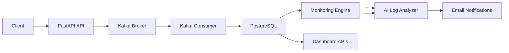

# LogSentinel

**AI-Powered Distributed Log Monitoring & Incident Intelligence Platformm**

SentinelAI is a production-style distributed observability system that performs real-time log ingestion, automated anomaly detection, intelligent alerting, and AI-powered root cause summarization.

Built using FastAPI, Kafka, PostgreSQL, and Docker, the system simulates a scalable monitoring architecture used in modern cloud-native environments.

---

## 📖 Overview

LogSentinel simulates a production-grade observability pipeline:

1. Applications send logs via REST API
2. Logs are streamed through Kafka
3. A consumer processes and stores logs in PostgreSQL
4. A monitoring engine evaluates error rates
5. Alerts are triggered automatically when thresholds are exceeded
6. AI analyzes logs and generates root-cause summaries
7. Email notifications are sent with intelligent insights
8. A dashboard visualizes logs and alert data

The platform demonstrates event-driven architecture, distributed systems design, background scheduling, and AI integration for operational intelligence.

---

## 🏗 Architecture



### Components

- **API Service** – Log ingestion & dashboard endpoints
- **Kafka Broker** – Message streaming backbone
- **Consumer Service** – Processes and stores logs
- **PostgreSQL** – Persistent storage
- **Monitoring Engine** – Automated alert generation
- **Email Notification Service** – Sends alert emails
- **Dashboard UI** – Visualizes logs and alerts
- **Docker Compose** – Multi-container orchestration

---

## 🚀 Features

- Real-time log ingestion
- Kafka-based streaming pipeline
- Automated error rate monitoring
- Logs are analyzed using a Large Language Model (LLM)
- Active and historical alert tracking
- Email notifications for critical alerts
- Dashboard APIs
- Background monitoring thread
- Fully containerized environment

---

## 📧 Email Alerts

When error rates exceed configured thresholds:

- An alert is created and stored in the database
- The system sends an automated email notification
- Email contains:
  - Service name
  - Error rate percentage
  - Time window analyzed
  - Alert timestamp
  - AI Root Cause Summary:
    - Likely cause:
    - Suggested action

### Example Use Cases

- Service crash detection
- Error spike detection
- Production incident notification
- Automated operational monitoring

### Example Environment Variables for Email

SMTP_SERVER=smtp.gmail.com
SMTP_PORT=587
SMTP_USERNAME=your_email@gmail.com

SMTP_PASSWORD=your_app_password
ALERT_RECEIVER=admin@example.com

> ⚠️ Use app-specific passwords for production environments.

---

## ⚙️ Setup & Installation

### 1️⃣ Clone Repository

```bash
git clone https://github.com/yourusername/LogSentinel.git
cd LogSentinel
```

### 1️⃣ Create Environment File

```bash
POSTGRES_DB=logs_db
POSTGRES_USER=postgres
POSTGRES_PASSWORD=postgres
DATABASE_URL=postgresql://postgres:postgres@db:5432/logs_db
KAFKA_BOOTSTRAP_SERVERS=kafka:9092

SMTP_SERVER=smtp.gmail.com
SMTP_PORT=587
SMTP_USERNAME=your_email@gmail.com
SMTP_PASSWORD=your_app_password
ALERT_RECEIVER=admin@example.com
```

### 3️⃣ Run with Docker

```bash
docker compose up --build
```

### Access:

```
API → http://localhost:8000
Swagger Docs → http://localhost:8000/docs
Dashboard → http://localhost:8000/
```

### To stop services:

```bash
docker compose down
```

## 📡 API Endpoints

### Log Ingestion

```bash
POST /logs
```

### Monitoring & Alerts

```bash
GET /alerts/check
GET /api/alerts/active
GET /api/alerts/history
```

### Dashboard Data

```bash
GET /api/logs/recent
GET /api/stats/error-rates
```

## 🔍 Automated Monitoring

- Runs every 10 minutes (configurable)
- Calculates error rates per service
- Triggers alerts when thresholds are exceeded
- Stores alert history
- Tracks active alerts

### 🧪 Testing Alert System

- To simulate error spikes:

```bash
python send_bulk_errors.py
```

### 🛠 Tech Stack

- Python 3.11+
- FastAPI
- SQLAlchemy
- PostgreSQL
- Apache Kafka
- Docker & Docker Compose
- Uvicorn
- OpenAI API (LLM integration)

### 👤 Author

- Chetan Mittal
