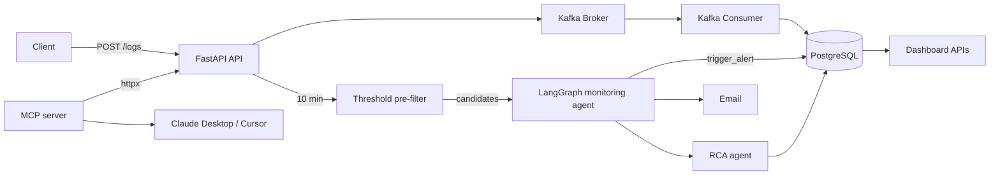

# LogSentinel

## Problem Statement

Modern software systems generate huge volumes of logs, but engineering teams often struggle to detect incidents quickly, understand the root cause, and communicate the issue clearly. Traditional monitoring is usually reactive and threshold-based, which can miss subtle failures or create noisy alerts.

LogSentinel solves this by combining real-time log ingestion, automated anomaly detection, AI-powered alert reasoning, and root cause analysis in one platform. It is designed to show how an observability system can move from raw logs to actionable incident intelligence.

## What this project demonstrates

This project is a full-stack demo of an AI-assisted observability platform. It shows how a system can:

- ingest logs from multiple services in real time
- detect unusual error spikes
- decide whether an alert should be raised
- generate a structured root cause analysis report
- present the findings through a dashboard and MCP tools

For a recruiter or hiring manager, the value is clear: this project reflects real-world engineering concerns around reliability, incident response, distributed systems, and AI-assisted operations.

Built with FastAPI, Kafka, PostgreSQL, Docker, and LangGraph, it is designed as a production-style prototype for learning, demoing, and discussion.

---

## 📖 Overview

LogSentinel simulates a production-grade observability pipeline:

1. Applications send logs via REST API
2. Logs are streamed through Kafka
3. A consumer processes and stores logs in PostgreSQL
4. A cheap threshold pre-filter selects candidate services each cycle
5. A LangGraph monitoring agent investigates candidates (error rate, log content, alert history) and decides whether to alert, assigning a severity (LOW/MEDIUM/HIGH/CRITICAL)
6. When an alert fires, an agentic RCA pipeline runs: it fetches logs +/-10 min around the alert, finds the first error, detects cascades across services, and produces a structured RCA report
7. Email notifications are sent with the agent reasoning + RCA report
8. A dashboard visualizes logs, alerts (with severity + agent reasoning), and RCA reports
9. An MCP server exposes the platform's data to AI assistants (Claude Desktop, Cursor)

The platform demonstrates event-driven architecture, distributed systems design, agentic reasoning (LangGraph), and the Model Context Protocol for operational intelligence.

---

## 🏗 Architecture


```mermaid
flowchart LR
    A[Client] -->|POST /logs| B[FastAPI API]
    B --> C[Kafka Broker]
    C --> D[Kafka Consumer]
    D --> E[(PostgreSQL)]

    B -->|10 min| F[Threshold pre-filter]
    F -->|candidates| G[LangGraph monitoring agent]
    G -->|trigger_alert| E
    G --> H[RCA agent]
    H --> E
    G --> I[Email]

    E --> J[Dashboard APIs]
    K[MCP server] -->|httpx| B
    K --> L[Claude Desktop / Cursor]
```

### Components

- **API Service** – Log ingestion, dashboard endpoints, RCA endpoint
- **Kafka Broker** – Message streaming backbone
- **Consumer Service** – Processes and stores logs
- **PostgreSQL** – Persistent storage (`logs`, `alerts`, `service_alerts`, `alert_history`)
- **Monitoring Agent** – Threshold pre-filter + LangGraph agent that decides and classifies alerts
- **RCA Agent** – Multi-step root cause analysis with cascade detection
- **MCP Server** – Exposes observability data to AI assistants
- **Email Notification Service** – Sends alert emails with agent reasoning + RCA
- **Dashboard UI** – Visualizes logs, alerts, and RCA reports
- **Docker Compose** – Orchestration & deployment

---

## 🚀 Features

- Real-time log ingestion from services through a REST API
- Kafka-based streaming pipeline for distributed event handling
- Hybrid monitoring using threshold checks plus an LLM-powered agent
- Severity classification such as LOW, MEDIUM, HIGH, and CRITICAL
- Agentic root cause analysis that explains likely causes and next actions
- Dashboard views for recent logs, alerts, and error-rate trends
- MCP integration for AI tools like Claude Desktop and Cursor
- Email notifications for important alerts
- Containerized setup with Docker Compose for easy local demoing
- Kubernetes manifests are also included in the k8s folder for deployment scenarios that need orchestration beyond Docker Compose

---

## 🧠 Engineering Narrative

This project was designed to show how an incident-response system can move from noisy logs to actionable insight.

### Why Kafka?

Kafka gives the system a durable, decoupled backbone for log streaming. Instead of writing directly to the database from every service, the platform can buffer events, absorb bursts, and let downstream consumers process them independently. That matters for reliability and for demonstrating how real distributed systems handle ingestion at scale.

### Why a threshold pre-filter and an LLM agent?

The threshold filter is cheap and fast, so the system can quickly identify likely problem areas without paying the cost of calling an LLM for every service. The LLM agent is then used selectively for deeper reasoning, where context and explanation are more valuable than raw speed.

### How cascade detection works

When an alert is triggered, the RCA pipeline looks at logs from the affected service and compares them to logs from other services in the same time window. If multiple services show correlated errors around the same time, the system flags a likely cascade and surfaces that in the RCA report.

### What would change in production?

A production version would add stronger durability, retries, backpressure controls, observability for the platform itself, better auth, and more robust model fallback and cost controls. It would also likely move from a demo-oriented single-node setup to a more scalable deployment with proper queue partitioning, monitoring, and incident workflows.

---

## 📧 Email Alerts

When error rates exceed configured thresholds:

- An alert is created and stored in the database
- The system sends an automated email notification
- Email contains:
  - Service name
  - Error rate percentage
  - Time window analyzed
  - Alert timestamp
  - AI Root Cause Summary:
    - Likely cause:
    - Suggested action

### Example Use Cases

- Service crash detection
- Error spike detection
- Production incident notification
- Automated operational monitoring

### Example Environment Variables for Email

```bash
SMTP_HOST=smtp.gmail.com
SMTP_PORT=587
SMTP_USER=your_email@gmail.com
SMTP_PASSWORD=your_app_password
ALERT_TO=admin@example.com
ALERT_FROM=alerts@example.com
```

> ⚠️ Use app-specific passwords for production environments.

---

## ⚙️ Setup & Installation

### 1️⃣ Clone Repository

```bash
git clone https://github.com/yourusername/LogSentinel.git
cd LogSentinel
```

### 2️⃣ Create Environment File

Copy `.env.example` to `.env` and fill in the values. See the full table below.

```bash
cp .env.example .env
```

| Variable                                                  | Required      | Purpose                                                                   |
| --------------------------------------------------------- | ------------- | ------------------------------------------------------------------------- |
| `DATABASE_URL`                                            | yes           | SQLAlchemy Postgres connection string                                     |
| `POSTGRES_DB` / `POSTGRES_USER` / `POSTGRES_PASSWORD`     | yes (compose) | Postgres container credentials                                            |
| `KAFKA_BOOTSTRAP_SERVERS`                                 | yes           | Kafka broker (default `kafka:9092`)                                       |
| `KAFKA_TOPIC`                                             | no            | Topic name (default `logs`)                                               |
| `ANTHROPIC_API_KEY`                                       | for AI        | Anthropic API key; without it the agents fall back to deterministic logic |
| `LLM_MODEL`                                               | no            | Claude model (default `claude-sonnet-4-5`)                                |
| `SMTP_HOST` / `SMTP_PORT` / `SMTP_USER` / `SMTP_PASSWORD` | for email     | SMTP delivery                                                             |
| `ALERT_TO` / `ALERT_FROM`                                 | for email     | Recipients / sender                                                       |
| `API_BASE_URL`                                            | MCP           | URL the MCP server uses to reach the API                                  |
| `MCP_TRANSPORT` / `MCP_PORT`                              | MCP           | `stdio` (default) or `http`                                               |
| `RUN_MONITOR_IN_API`                                      | no            | Set `false` when running a dedicated monitor service                      |

### 3️⃣ Run with Docker

```bash
docker compose up --build
```

### Access:

```
API → http://localhost:8000
Swagger Docs → http://localhost:8000/docs
Dashboard → http://localhost:8000/
```

### To stop services:

```bash
docker compose down
```

## 📡 API Endpoints

### Log Ingestion

```bash
POST /logs
```

### Monitoring & Alerts

```bash
GET /alerts/check
GET /api/alerts/active
GET /api/alerts/history
```

### Dashboard Data

```bash
GET /api/logs/recent?limit=50&service=<optional>
GET /api/stats/error-rates?service=<optional>
```

### Root Cause Analysis

```bash
GET /api/alerts/{alert_id}/rca
```

## 🔍 Automated Monitoring

- Runs every 10 minutes (configurable)
- Calculates error rates per service
- Triggers alerts when thresholds are exceeded
- Stores alert history
- Tracks active alerts

### 🧪 Testing Alert System

- To simulate error spikes:

```bash
python send_bulk_errors.py
```

### 🛠 Tech Stack

- Python 3.11+
- FastAPI + Uvicorn
- SQLAlchemy + PostgreSQL
- Apache Kafka
- Docker & Docker Compose
- LangGraph + langchain-anthropic (monitoring agent)
- Anthropic Claude (`claude-sonnet-4-5`) or Groq
- Model Context Protocol (`mcp` SDK)

---

## 🤖 MCP Server

LogSentinel ships an MCP server (`mcp_server.py`) that exposes its observability
data as tools by proxying the FastAPI endpoints:

- `get_active_alerts()`
- `get_alert_history(limit=20)`
- `get_recent_logs(service, limit=50)`
- `get_error_rates(service)`
- `trigger_alert_check()`

### Test the tools locally

```bash
# Start the API first (so the tools have something to call)
docker compose up --build

# In another terminal, inspect the MCP server
mcp dev mcp_server.py
```

### Connect to Claude Desktop

Add this to your `claude_desktop_config.json`
(macOS: `~/Library/Application Support/Claude/claude_desktop_config.json`,
Windows: `%APPDATA%\Claude\claude_desktop_config.json`):

```json
{
  "mcpServers": {
    "logsentinel": {
      "command": "python",
      "args": ["C:/path/to/LogSentinel/mcp_server.py"],
      "env": {
        "API_BASE_URL": "http://localhost:8000",
        "MCP_TRANSPORT": "stdio"
      }
    }
  }
}
```

### Connect to Cursor

Add this to `.cursor/mcp.json` (project) or `~/.cursor/mcp.json` (global):

```json
{
  "mcpServers": {
    "logsentinel": {
      "command": "python",
      "args": ["C:/path/to/LogSentinel/mcp_server.py"],
      "env": {
        "API_BASE_URL": "http://localhost:8000",
        "MCP_TRANSPORT": "stdio"
      }
    }
  }
}
```

The `mcp` service in `docker-compose.yml` runs the same server over streamable
HTTP (`MCP_TRANSPORT=http`, port `8001`) for containerized/remote use.

---

## 🚀 Deployment Notes

This project is designed to run locally with Docker Compose and can also be adapted
for other hosting platforms.

### 👤 Author

- Chetan Mittal
